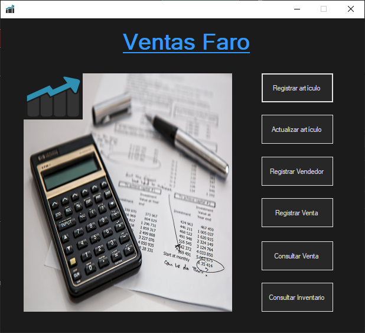
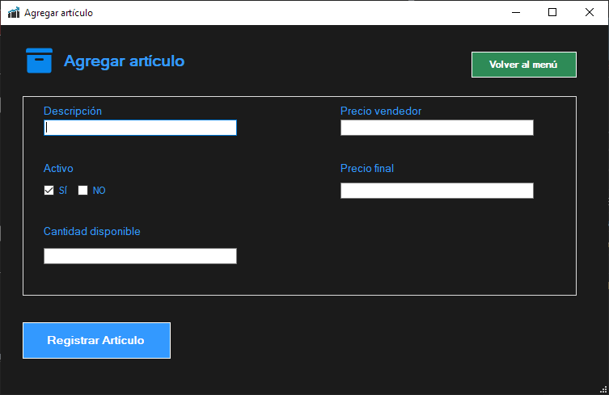
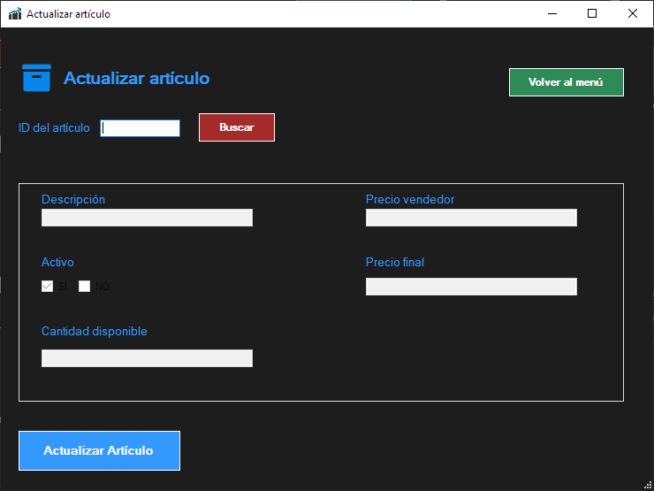
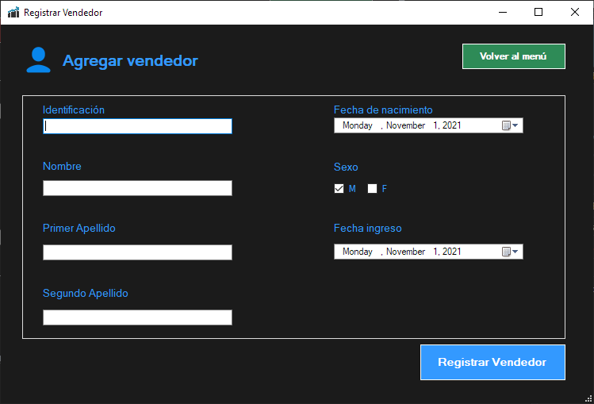
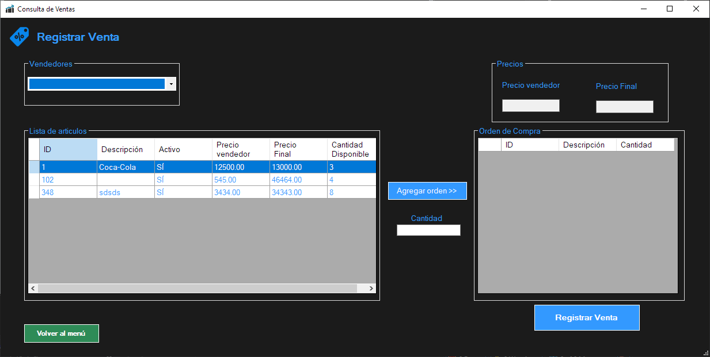
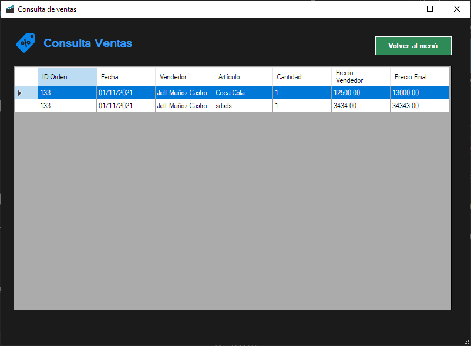
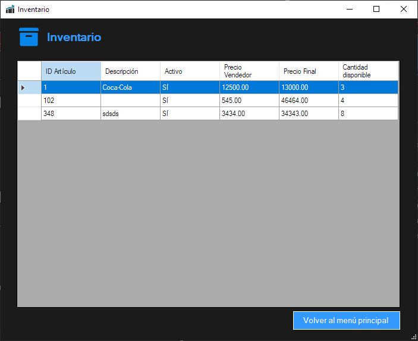

# Programa de venta de artículos

Programa que permite gestionar el control y venta de artículos.

## Características

* Creación, edición y consulta de artículos de venta.
* Creación de vendedores.
* Creación y consulta de ventas.

## Consideraciones

* Uso de .NET Framework 4.8
* Uso de Entity Framework.
* Uso de SQL Server.
* Uso de Visual Studio 2019.
* Windows 10.
* Incluye el script de la base de datos.

## Capturas

### Menú principal

### Registrar Artículo

### Actualizar Artículo

### Registrar vendedor

### Registrar Venta

### Consultar ventas

### Consulta Inventario

